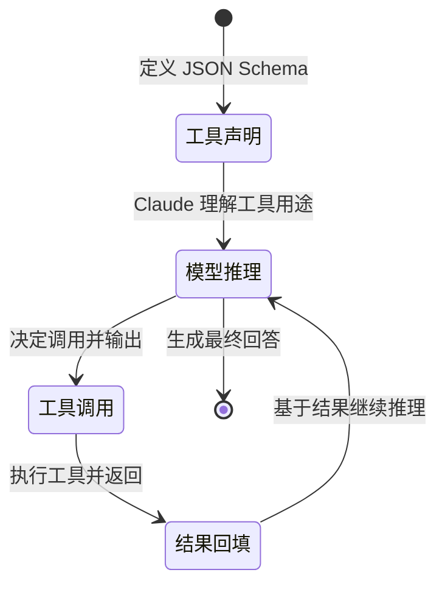

# Emoji 增强结构化输出设计方案 v2.0

> 基于 Claude Code 最佳实践的生产级实现方案

---

## 目录

1. [核心概念与架构](#1-核心概念与架构)
2. [Claude 结构化输出深度解析](#2-claude-结构化输出深度解析)
3. [Emoji 增强体系](#3-emoji-增强体系)
4. [四种实现方案对比](#4-四种实现方案对比)
5. [生产级代码实现](#5-生产级代码实现)
6. [Schema 设计模式](#6-schema-设计模式)
7. [验证与重试机制](#7-验证与重试机制)
8. [性能优化与监控](#8-性能优化与监控)
9. [测试策略](#9-测试策略)
10. [最佳实践](#10-最佳实践)

---

## 1. 核心概念与架构

### 1.1 结构化输出的本质

结构化输出不是"让模型输出 JSON"，而是**让模型的输出具有确定的类型和结构**，从而可以被程序可靠地处理。

```
传统方式（脆弱）：
用户 → 模型 → "北京今天晴，15°C" → 正则解析 ❌

结构化输出（可靠）：
用户 → 模型 → {city: "北京", temp: 15, condition: "晴"} → JSON 解析 ✅
```

### 1.2 Claude Code 的实现架构

Claude Code 内部使用三层架构实现结构化输出：

```
┌─────────────────────────────────────────────────────────┐
│  用户交互层                                               │
│  - 自然语言请求                                           │
│  - 命令解析                                               │
│  - 输出格式化（Emoji + ASCII）                            │
├─────────────────────────────────────────────────────────┤
│  执行层                                                   │
│  - Agent 状态机                                           │
│  - Tool 调度                                              │
│  - 结果聚合                                               │
├─────────────────────────────────────────────────────────┤
│  Claude API 层                                           │
│  - Tool Use（结构化输出）                                 │
│  - Content Blocks                                         │
│  - Streaming（流式输出）                                  │
└─────────────────────────────────────────────────────────┘
```

**关键洞察**：
- **输出格式化在用户交互层**：Emoji 和 ASCII 图表是给人类看的，不在 API 层
- **结构化输出在 Claude API 层**：Tool Use 保证数据可靠性
- **执行层负责桥接**：将结构化数据转换为用户友好的可视化输出

### 1.3 核心优势对比

| 维度 | 自由文本 | 结构化输出 | 差异 |
|------|----------|------------|------|
| **可靠性** | 60-70% | 95%+ | 正则解析 vs JSON Schema |
| **解析成本** | 高（NLP/正则） | 低（直接解析） | 10x+ |
| **错误率** | 20-30% | <5% | 字段缺失/类型错误 |
| **组合性** | 差 | 优秀 | 数据可链式处理 |
| **调试难度** | 高 | 低 | 明确的结构 vs 模糊文本 |

---

## 2. Claude 结构化输出深度解析

### 2.1 Tool Use 完整生命周期



### 2.2 Content Blocks 详解

Claude 的 Content Blocks 是**一等公民**，三种类型可自由组合：

```json
{
  "role": "assistant",
  "content": [
    {
      "type": "text",
      "text": "我来帮你查一下天气信息。"
    },
    {
      "type": "tool_use",
      "id": "toolu_01ABC123",
      "name": "get_weather",
      "input": {
        "city": "北京",
        "days": 3,
        "units": "celsius"
      }
    },
    {
      "type": "text",
      "text": "现在让我分析一下数据趋势..."
    },
    {
      "type": "tool_use",
      "id": "toolu_01DEF456",
      "name": "analyze_trend",
      "input": {
        "metric": "temperature",
        "period": "7d"
      }
    }
  ]
}
```

**关键特性**：
- ✅ **混合编排**：`text` 和 `tool_use` 可交错出现
- ✅ **并行调用**：多个 `tool_use` 可同时发起
- ✅ **引用传递**：后续工具可使用前面工具的结果

### 2.3 JSON Schema 约束机制

#### 2.3.1 Schema 结构

```json
{
  "type": "object",
  "properties": {
    "field_name": {
      "type": "string | number | boolean | object | array",
      "description": "字段描述（关键！）",
      "enum": ["option1", "option2"],  // 枚举约束
      "minimum": 0,                      // 数值范围
      "maxLength": 100,                  // 字符串长度
      "pattern": "^[a-z]+$",            // 正则匹配
      "default": "value",               // 默认值
      "format": "email | uri | date-time"  // 格式校验
    }
  },
  "required": ["field1", "field2"],    // 必填字段
  "additionalProperties": false        // 禁止额外字段
}
```

#### 2.3.2 约束强度分级

| 约束类型 | 强度 | 示例 |
|---------|------|------|
| **类型约束** | 高 | `"type": "string"` |
| **必填约束** | 高 | `"required": ["name"]` |
| **枚举约束** | 高 | `"enum": ["a", "b"]` |
| **描述引导** | 中 | `"description": "..."`