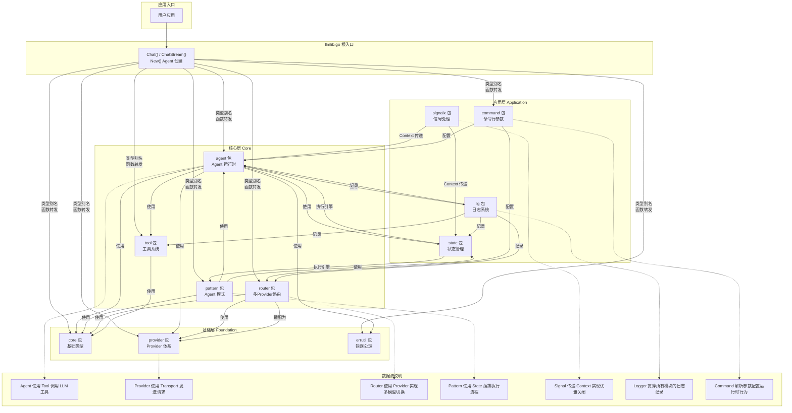
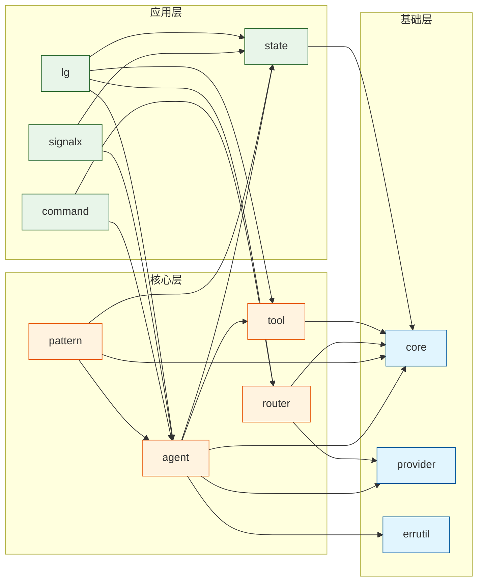

# llmLib 模块关系思维导图

## 综合思维导图

```mermaid
mindmap
  root((llmlib 开发库))
    基础层
      KP01-基础类型
        core.LLMConfig
        core.Message/Role
        core.ChatRequest/Response
        core.ToolCall/ToolDef
        core.StreamChunk
      KP02-Provider体系
        provider.Provider 接口
        provider.ToolCallProvider
        8种Provider实现
        NewProvider()
      KP03-错误处理
        errutil.AgentError
        errutil.ErrorCategory
        errutil.RetryWithBackoff
        errutil.ClassifyError
    核心层
      KP04-工具系统
        tool.Tool 接口
        tool.Registry 注册表
        tool.JSONSchemaTool
        tool.CalculatorTool/TimeTool
        tool.BuildToolDefs
      KP05-Agent运行时
        agent.Agent 主体
        agent.AgentEvent 事件
        agent.Store/FileStore 存储
        agent.Phase 阶段
        agent.Task/Plan 任务计划
      KP06-Agent模式
        pattern.Chain 链式
        pattern.Evaluator 评估式
        pattern.Parallel 并行式
        pattern.Orchestrator 编排式
        pattern.Router 路由式
      KP07-多Provider路由
        router.Router 路由器
        router.Strategy 策略
        router.RouterAdapter
        router.LLMService
        router.LoadAll/LoadDotEnv
    应用层
      KP08-命令行参数
        command.CommandBuilder
        command.LoadCommands
        command.Register/Parse
      KP09-日志系统
        lg.Logger 日志器
        lg.Entry 日志记录
        lg.Writer 输出接口
        lg.Router 日志路由
        lg.Frame 框架日志
      KP10-信号处理
        signalx.SignalContext
        优雅关闭机制
      KP11-状态管理
        state.Machine 状态机
        state.Workflow 工作流
        state.Step 步骤
        state.Middleware 中间件
```

## 数据流向图



## 模块依赖关系图



## 三层架构说明

### 基础层（Foundation Layer）— KP01 ~ KP03

提供所有上层模块的基础类型和抽象，不依赖任何上层模块。

| 模块 | 知识点 | 核心职责 |
|---|---|---|
| `core` | KP01 | 定义 `LLMConfig`、`Message`、`ChatRequest/Response`、`ToolCall`、`StreamChunk` 等核心数据结构 |
| `provider` | KP02 | 定义 `Provider` 接口，实现 8 种 LLM 服务商的 API 调用 |
| `errutil` | KP03 | 定义 `AgentError`、错误分类、重试退避等错误处理基础设施 |

### 核心层（Core Layer）— KP04 ~ KP07

基于基础层构建，提供 Agent 运行时的核心能力。

| 模块 | 知识点 | 核心职责 |
|---|---|---|
| `tool` | KP04 | 定义 `Tool` 接口，提供工具注册表、工具调用范式检测 |
| `agent` | KP05 | Agent 主体，实现 Think-Act-Observe 循环、事件系统、会话存储 |
| `pattern` | KP06 | 5 大 Agent 范式：Chain/Evaluator/Parallel/Orchestrator/Router |
| `router` | KP07 | 多 Provider 智能路由，支持最便宜/最低延迟策略，环境变量配置 |

### 应用层（Application Layer）— KP08 ~ KP11

提供应用开发所需的辅助功能，可与核心层灵活组合。

| 模块 | 知识点 | 核心职责 |
|---|---|---|
| `command` | KP08 | 可扩展的命令行参数解析系统 |
| `lg` | KP09 | 结构化日志系统，支持模块化分流、多输出目标 |
| `signalx` | KP10 | 系统信号处理，优雅关闭机制 |
| `state` | KP11 | 通用状态机和工作流执行引擎 |

## 关键关系说明

| 关系 | 说明 |
|---|---|
| **Agent → Tool** | Agent 运行时通过 `ToolSet` 调用工具，实现 Act 阶段 |
| **Agent → Provider** | Agent 通过 `Provider` 与 LLM API 通信，实现 Think 阶段 |
| **Agent → State** | Agent 使用 `state.Workflow` 组织 Think-Act-Observe 循环 |
| **Pattern → State** | Pattern 使用 `state` 包的状态机实现各种 Agent 范式的编排 |
| **Router → Provider** | `RouterAdapter` 将 Router 适配为 Provider，实现多模型自动切换 |
| **Tool → Core** | 工具的 `ToolDef`、`ToolFunction` 等类型定义在 `core` 包 |
| **Signal → Agent/State** | `SignalContext` 传递的 Context 用于 Agent 和状态机的优雅中止 |
| **Logger → 全局** | `lg` 包贯穿所有模块，提供统一的日志记录能力 |
| **Command → Agent/Router** | 命令行参数用于配置 Agent 和 Router 的运行时行为 |
| **ErrUtil → Agent** | Agent 使用 `errutil` 进行错误分类和重试 |